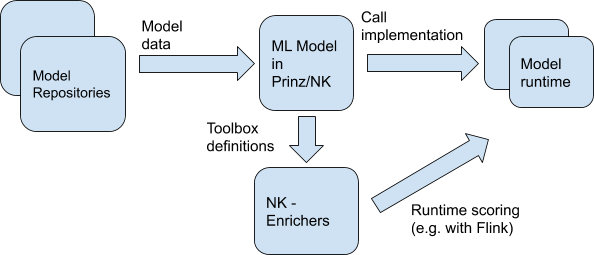

# Prinz

## Nussknacker - operation model

## Configuring your own models

Adding / configuring your own model consists of:
* Implementing the ProcessConfigCreator interface, describing what items are available in the toolbox, what is the data model,
etc. Some elements (filters, etc.) are predefined, others are common across different models (e.g. Integration with AVRO etc.)
* Model run configuration, e.g.
    * Reference to the Kafka cluster
    * References to external services
    * UI configuration: Links to the documentation, default values etc.

## What will be the “product” - i.e. what will Prinz be?

Prinz will be a library of extensions for Nussknacker. Moreover, it should also provide an API that will allow adding new
integrations with model repositories / engines for ML models.
For now, it can be assumed that there will be no separate runtime - i.e. a separate application, we assume that the NK
 library will communicate with the model repositories and retrieve the necessary information / artifacts on an ongoing basis.

In the future, however, it may be needed - e.g. to be able to more easily share some artifacts between different deployments /
NK diagrams.

We can distinguish three actors who will have contact with these extensions:
* NK configurator - uses the UI to configure a business scenario using ML models. He does not need to know how the model
was made or how it is shared. He has access to a specific item in the NK toolbox and his task is to configure it (define
the values of the model features).
* Creator / administrator of the Nussknacker model. He uses the Nussknacker API (ProcessConfigCreator) to integrate NK into
 the ML system. In code / configuration, he uses the Prinz API implementation for specific ML systems (e.g. MLFlow).
* Developer of new integrations with ML systems. He uses the Prinz API to enable usage for the creators of Nussknacker data
models.

In the first step, we assume that the configurator will fill in all the features of the model by himself. However, later
we want to partially automate it - i.e. the creator of the Nussknacker model will be able to determine where to get at least
some of the data for the model - e.g. from a database with a customer profile, predefined aggregates, etc.

## Prinz's internal model

We assume that an API that will enable relatively easy addition of further implementations of model repositories / runtime
ML models will be created.

API implementation for a given ML system will consist of two parts:
* Retrieving data about models from the ML model registry
* Calling scoring on a given model -> i.e. calling runtime of a given model

In the first stage, the translation of a model from a registry (e.g. MLFlow) to a Prinz / NK model will probably be quite
simple - a list of models, for each one of them a list of parameters with types, possibly additional metadata such as description,
a link to the documentation. In later stages, other operations may be added (e.g. retrieving some data from external sources,
etc.) - that is why it is probably worth establishing your own data model.

Examples of model repositories:
* MLFlow has its own solution that serves a REST API
* Repository described by a configuration file (fixed) - this may make sense when we have a few simple models that rarely change

Examples of model runtimes:
* Model issued as a REST API in a container - then the model configuration / repository should know the API reference, the implementation of this runtime is an HTTP client that calls the appropriate service
* PMML as a model description in the form of XML - model implementation in this runtime is XML + a library that allows its interpretation.
* Generated code (e.g. via H2O or other custom solutions) - then the runtime of this model is a wrapper for the generated code