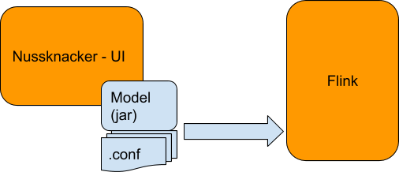

## Nussknacker - operation model

## Configuring your own models

Adding / configuring your own model consists of:
* Implementing the ProcessConfigCreator interface, describing what items are available in the toolbox, what is the data model,
  etc. Some elements (filters, etc.) are predefined, others are common across different models (e.g. Integration with AVRO etc.)
* Model run configuration, e.g.
    * Reference to the Kafka cluster
    * References to external services
    * UI configuration: Links to the documentation, default values etc.
