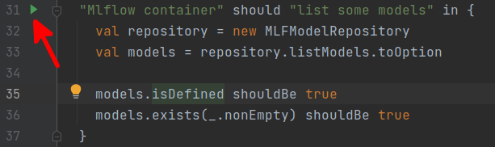
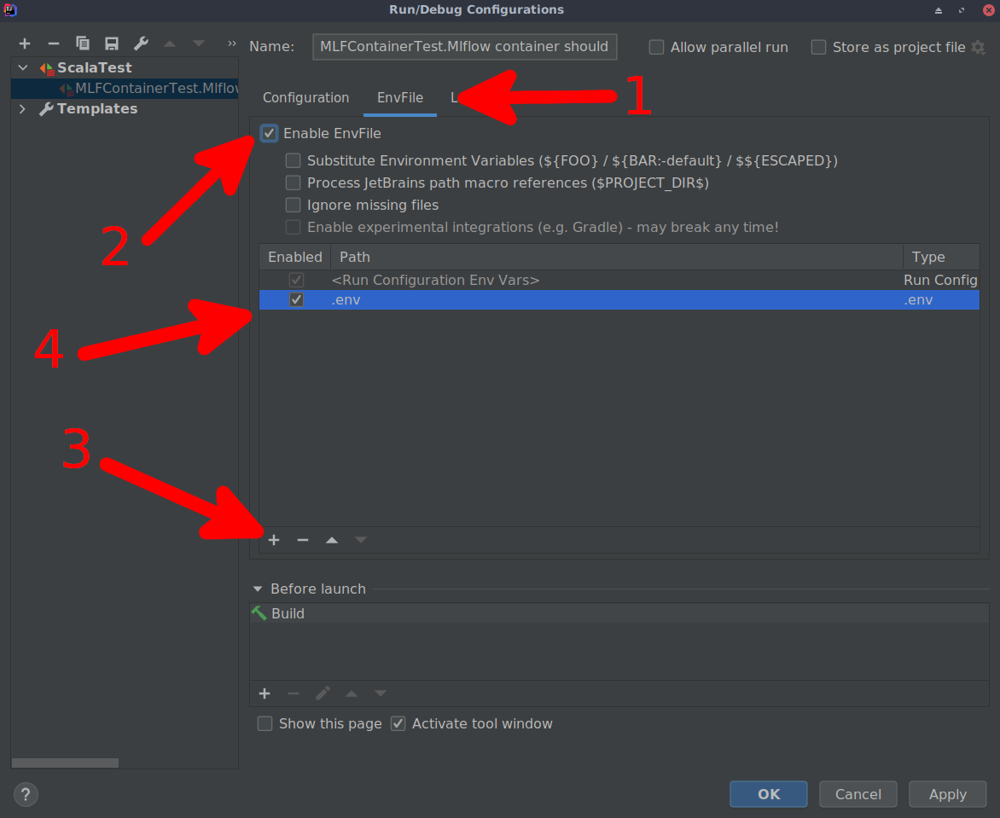

# Compile and run tests

## Docker image access

In order to run tests, custom docker images are needed. They can be build locally, but they are also available on the
GitHub Dockerhub repository. Inorder to use the Docker images from this repository one need to be logged. Follow the
[official guidelines](https://docs.github.com/en/packages/guides/configuring-docker-for-use-with-github-packages#authenticating-to-github-packages) from GitHub to login to your account.

## Repository location

Before trying to run tests locally one have to define the environment variable that will point to
root folder of this repository as an absolute path on file system. It is needed as running the tests from IDE
have the other relative home path than when running on CI pipeline. This can be done from terminal by running
```shell
export REPOSITORY_ABSOLUTE_ROOT=$(pwd)
```
from repository root folder or by defining the environment variable in the IDE with proper absolute path to repository root.

## Command line

Tests can be easily run using the `sbtwrapper` and the commands the same as in the [unit_tests.yaml]({{ book.sourcesRootUrl }}.github/workflows/unit_tests.yaml)
file so for example to run MLflow integration tests one would use the command
```shell

./sbtwrapper prinz_mlflow/test
```

## Intellij IDEA

There is a possibility to run the tests in the IDE and debug them step by step. In order to have the environment properly
configured the extra [EnvFile](https://plugins.jetbrains.com/plugin/7861-envfile) plugin is needed.

Download the plugin and try to run selected test by clicking the green arrow near the code numbering


When running test fails with the message containing
```shell
services.proxy.ports value [':', ':', ':'] has non-unique elements
```
(which means there are non-configured env variables which should be filled before setting the environment)
the test configuration is generated in IDE and is accessible in the top of your IDE


In order to run test one need to edit generated configuration with downloaded
plugin by entering the configuration setup and selecting the [.env]({{ book.sourcesRootUrl }}.env) configuration
file available in the repository


After adding this configuration file with environment definition running test should be possible from the IDE.
